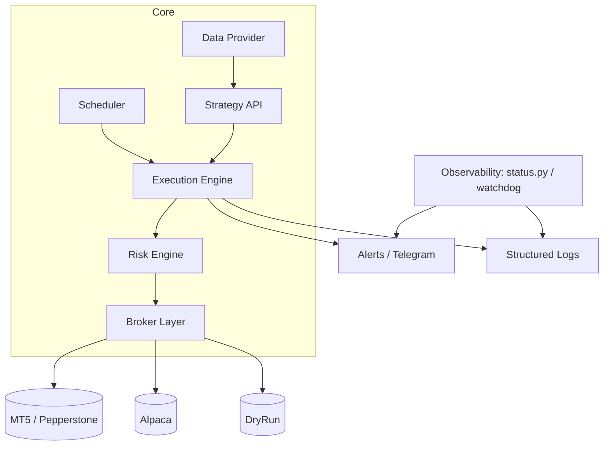
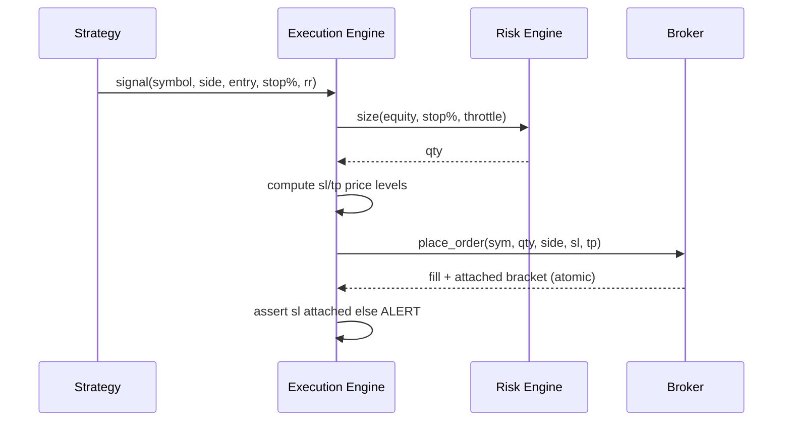
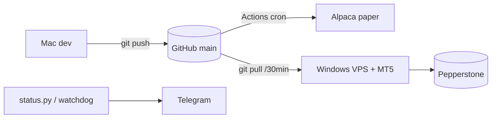

# ARCHITECTURE V2 — nas100-trader

_Redesign blueprint. This is the target architecture; V1 (the current running system)
is described in the migration section so the two never get confused._

---

## 0. Design principles (learned the hard way)

1. **Broker enforces risk, not the bot.** Every position carries a broker-side stop.
   The 6-day VPS outage proved bot-managed exits are not safe alone.
2. **Backtest and live share ONE strategy definition.** The V1 bugs (naked orders,
   simulated-only exits) came from two divergent code paths. V2 has one.
3. **Fail loud, never silent.** A crash must alert, not vanish. (The emoji crash ran
   silently for 6 days.)
4. **ASCII everywhere in production output.** No emoji/box-draw in logs.
5. **Single source of truth deployment.** Git clone on every host; no ZIP drift.
6. **Every strategy is a plugin** with a declared exit contract. No exit = won't load.

---

## 1. Module map



| Module | Responsibility | V1 file(s) |
|---|---|---|
| Scheduler | fire sessions on time, self-gate by clock | `schedule_mt5.ps1`, GH Actions |
| Data Provider | OHLCV bars, options/GEX, regime | `get_bars`, `get_regime`, `get_gex_levels` |
| Strategy API | signal + **exit contract** | `run_s1..s5`, `run_btc`, etc. |
| Execution Engine | translate signal → order + brackets | `place_order_safe` |
| Risk Engine | sizing, DD-throttle, kill-switch | `update_risk_state` |
| Broker Layer | venue adapters (bracket-aware) | `*_broker.py` |
| Observability | health, watchdog, alerts | `status.py`, `s5_watchdog.py`, `alerts.py` |

---

## 2. Execution Engine

**Contract:** a strategy returns an `Order(symbol, side, qty, sl, tp, exit_policy)`.
The engine NEVER places an order without a resolved `sl` (or an explicit, logged
`exit_policy` of type `state_machine`/`time`).



- Orders are **atomic with their bracket** (MT5 `TRADE_ACTION_DEAL` + sl/tp).
- **Reconcile pass** each run: if state says "in position" but broker shows flat,
  the bracket closed it → clear state, never re-sell (V1 BTC short-risk bug).
- Naked order → WARNING + Telegram.

---

## 3. Broker Layer

Adapter ABC: `get_bars, get_account, get_positions, place_order(sl,tp), close_position`.

| Adapter | Brackets | Status | Use |
|---|---|---|---|
| MT5 / Pepperstone | ✅ SL+TP atomic | prod | CFD prop book |
| Alpaca | ⛔ V2 must add bracket orders | paper | equities |
| DryRun (wrapper) | passthrough (prints intended bracket) | test | all |
| Binance/cTrader/Tradovate | ⛔ not bracket-aware | dormant | future |

**V2 rule:** an adapter that cannot attach a stop must declare
`SUPPORTS_BRACKET = False`; the engine then refuses live orders through it (dry-run
only), instead of silently placing naked (V1 TypeError-fallback footgun).

---

## 4. Risk Engine

- **Position sizing:** `qty = equity * risk_frac * vix_mult * throttle / (price * stop)`.
- **Conformal DD-throttle:** scales size down as live drawdown nears `target_drawdown`
  (0.08). Holds account under prop limits.
- **Kill-switch:** daily loss > 5% or monthly > 4% → halt new orders.
- **Per-account state** (`risk_state_<broker>.json`) so one account's peak can't throttle another.
- **V2 addition:** a global `MAX_OPEN_RISK` cap = Σ(open position stop-distances); refuse
  new entries that would exceed it. Prevents correlated stack-up.

See [[04 Risk Engine]].

---

## 5. Scheduler

- Hosts self-gate: strategies check the clock, so frequent triggers are safe.
- MT5 sessions: hourly `all`, 30-min `overnight`, hourly `btc`, daily `btctrend/rebal`.
- Alpaca: GitHub Actions cron.
- **V2:** one declarative schedule file per host, generated from a single
  `sessions.yaml` (source of truth), so MT5/Actions never drift.

---

## 6. Strategy API (plugin contract)

```
class Strategy:
    key: str                     # "S1"
    universe: list[str]          # internal symbols
    def signal(ctx) -> Order|None
    exit_policy: "bracket" | "state_machine" | "time"
    stop_pct: float              # REQUIRED
    rr: float | None             # None for time/state exits
```

Loader **rejects** any strategy with `exit_policy == bracket` and no `stop_pct`.
This makes the naked-order class of bug structurally impossible.

See [[03 Validated Strategies]].

---

## 7. Testing

| Layer | What | Tool |
|---|---|---|
| Unit | sizing, sl/tp math, reconcile logic | pytest |
| Gauntlet | IS/OOS walk-forward + costs + corr + regime | `edge_hunt.py` |
| Robustness | pass across a panel of splits (6/6) | `edge_hunt.py --sweep` |
| Execution | one demo order shows SL/TP | `test_order.py` |
| Liveness | signals fire on recent data | `verify_liveness.py` |
| Prop sim | rule/consistency Monte-Carlo | `prop_sim.py` |
| Health | venues green | `status.py` |

**V2 gate:** CI runs unit + gauntlet on every push; a strategy can't merge without
a robustness pass logged in [[02 Strategy Research]].

---

## 8. Deployment



- VPS is a **git clone** (auto-pull every 30 min).
- Secrets in `config.ini` (gitignored) / GitHub Secrets — never committed.
- Per-venue logs `mt5_<session>.log`.
- Watchdog alerts if S5's 9:00 ET bar goes missing in-window.

See [[07 Deployment]].

---

## 9. Migration plan (V1 → V2)

| Phase | Action | Risk |
|---|---|---|
| 0 | **Freeze V1** (current running system) — it is now execution-safe | none |
| 1 | Extract `sessions.yaml` from `schedule_mt5.ps1` + Actions | low |
| 2 | Wrap each `run_sX` in the Strategy plugin contract (no logic change) | low |
| 3 | Add `SUPPORTS_BRACKET` gate to Broker ABC; Alpaca bracket orders | med |
| 4 | Introduce `MAX_OPEN_RISK` cap in Risk Engine | med |
| 5 | Move scheduler generation to `sessions.yaml` | low |
| 6 | CI gauntlet gate on merge | low |

**Golden rule of migration:** V1 keeps trading demo throughout. V2 modules are proven
on DryRun + demo before replacing a V1 path. No big-bang rewrite.

---

## 10. Non-goals

- No HFT / orderflow engine (needs infra we don't have — see [[12 Ideas]]).
- No options execution (prop firms are CFD/futures only).
- No new edges until the current book confirms live ([[10 Roadmap]]).
