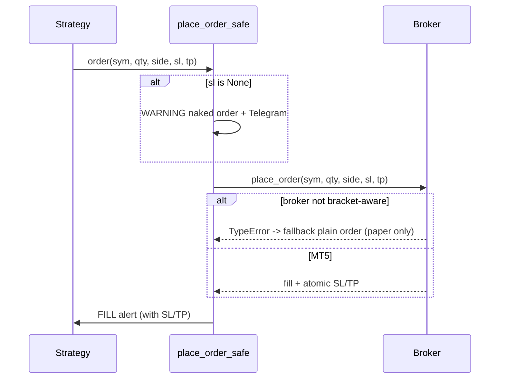

# 06 Execution Engine

Turns a signal into a protected order. Core: `place_order_safe(sym, qty, side, tag, sl, tp)`.

## Rules
- Retry-with-backoff, never double-send.
- Naked order -> WARNING (structurally discouraged; V2 loader forbids it).
- **Reconcile:** state-machine strategies (BTC) check `if in state but flat -> broker
  bracket closed it -> clear state, never re-sell` (prevents accidental short).

See [[04 Risk Engine]] | [[05-Broker-Integrations/_index|Brokers]] | [[08-Incidents-and-Postmortems/2026-07-07 Naked Orders|naked-orders incident]]
