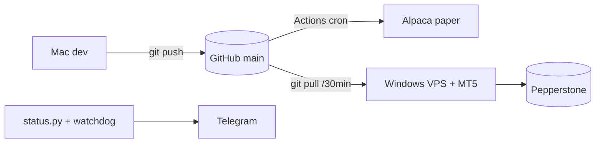

# 07 Deployment

## Hosts
- **VPS (188.190.4.122)**: Windows, MT5 open + RDP disconnected. Real git clone,
  auto-pull every 30 min (`nas100-update` task). Sessions via `schedule_mt5.ps1`:
  hourly `all`, 30-min `overnight`, hourly `btc`, daily `btctrend/rebal`, hourly `S5Watchdog`.
- **GitHub Actions**: Alpaca `all` + `overnight` crons (Linux, UTF-8).

## Setup
- `iex (irm .../setup_vps_git.ps1)` = install git, clone, register tasks (git route)
- `iex (irm .../setup_vps.ps1)` = ZIP fallback (no git)

## Discipline
- Secrets in `config.ini` (gitignored) / GitHub Secrets. Never commit.
- ASCII-only production output. Per-venue logs `mt5_<session>.log`.

Ops tools: `status.py`, `s5_watchdog.py`, `protect_positions.py`, `test_order.py`.
Back: [[00 Dashboard]] | [[06 Execution Engine]]
